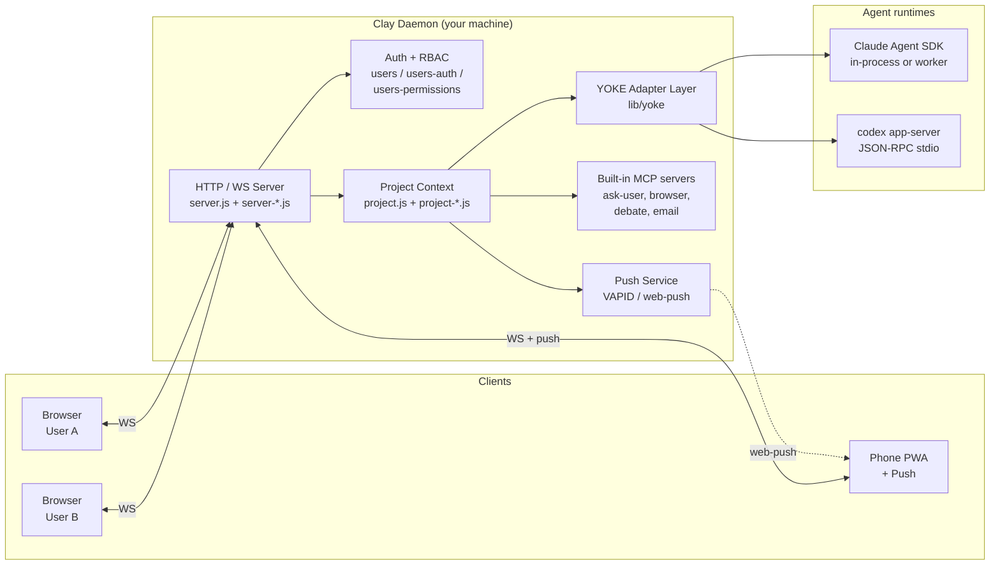
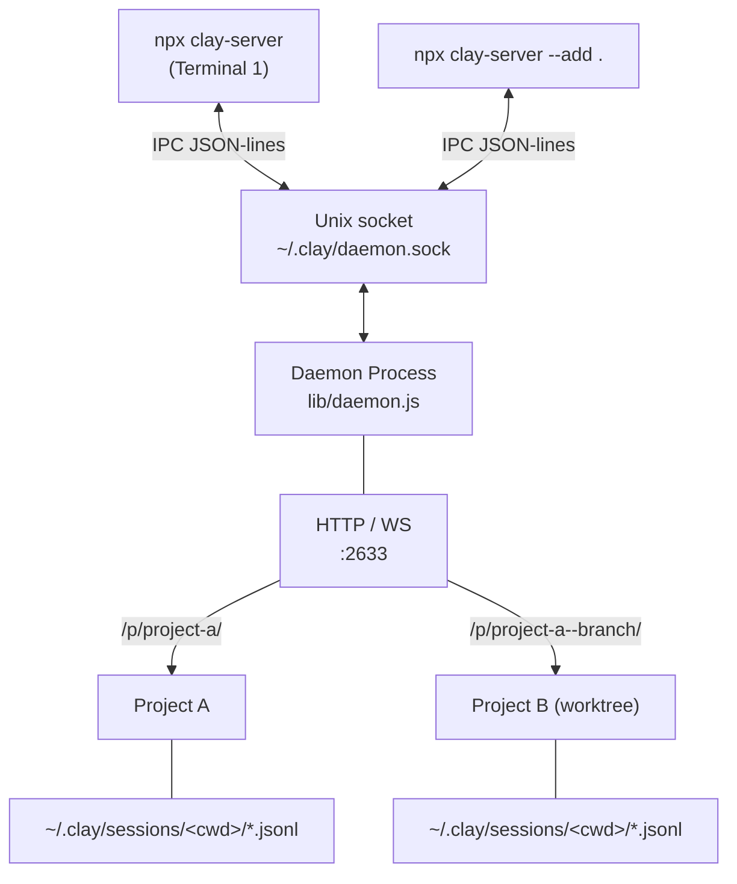
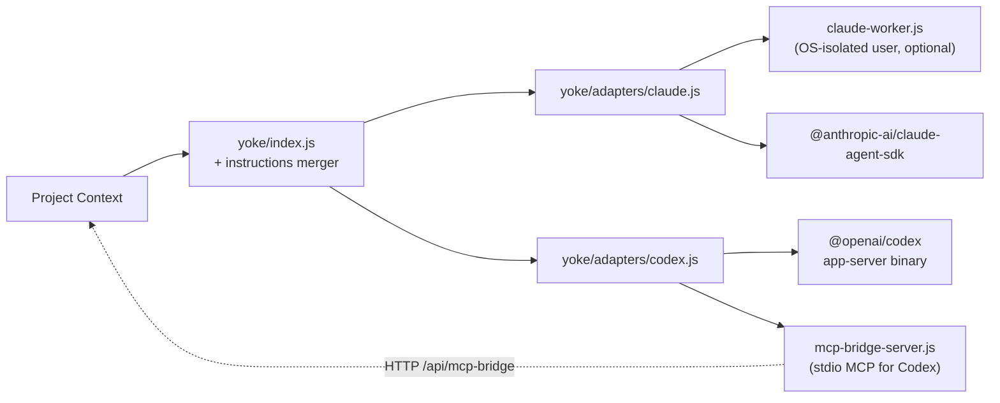
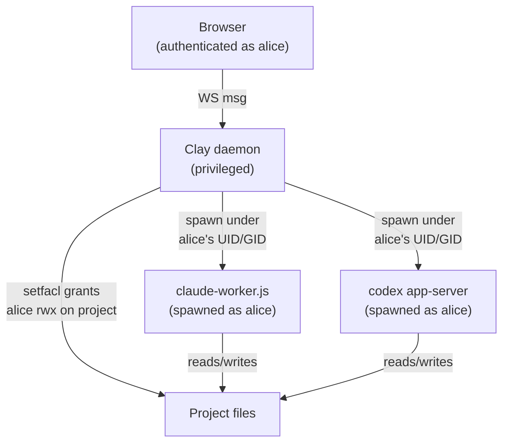
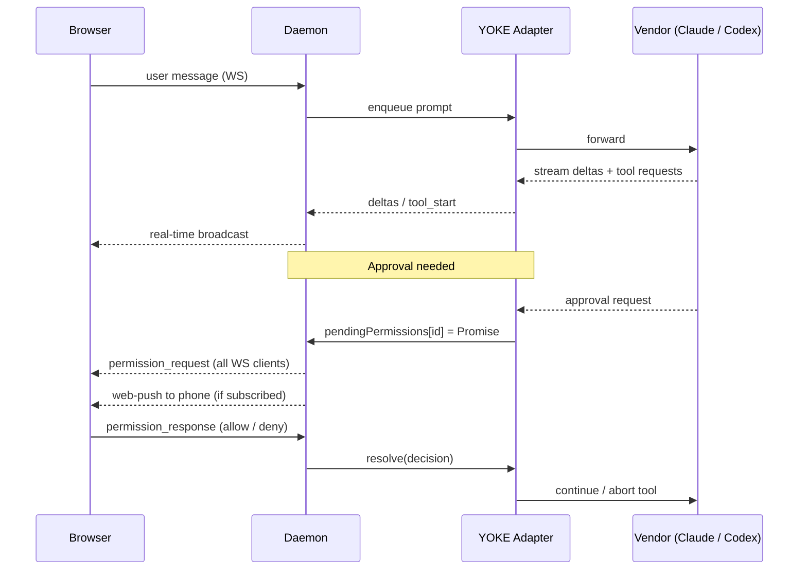

# Architecture

Clay is not a CLI wrapper. It is a self-hosted daemon that drives **Claude Code** (via the [Claude Agent SDK](https://www.npmjs.com/package/@anthropic-ai/claude-agent-sdk)) and **Codex** (via the `codex app-server` JSON-RPC protocol) through a vendor-agnostic adapter layer (**YOKE**), and serves a multi-user web workspace over HTTP/WS.

Everything runs on your machine. Sessions, Mates, knowledge, and settings live as plain JSONL/Markdown on disk. No cloud relay, no proprietary database.

## System Overview



## CLI ↔ Daemon

Clay decouples the CLI from the long-running server. The CLI starts (or attaches to) a detached daemon over a Unix domain socket.



The daemon is spawned with `detached: true` and survives CLI exit. Multiple CLI instances share one daemon. IPC commands include `add_project`, `remove_project`, `set_pin`, `set_keep_awake`, `shutdown`, `get_status`.

## YOKE Adapter Layer

YOKE (Yoke Overrides Known Engines) is the vendor abstraction. Each adapter implements the same contract (`init`, `createQuery`, etc.), so `project.js` never has to know which agent runtime is driving a session.



**Cross-vendor instruction merging.** On every `createQuery`, YOKE scans the project for instruction files (`CLAUDE.md`, `AGENTS.md`, `.cursorrules`, …), drops the ones the current vendor reads natively, and merges the rest into `systemPrompt`. The result: a Codex session sees `CLAUDE.md` content, a Claude session sees `AGENTS.md` content. Switching vendors does not break project context.

**Codex specifics.** Codex talks to Clay via JSON-RPC 2.0 over its app-server's stdin/stdout (`yoke/codex-app-server.js`). Approval events, skill injection, and MCP tool calls travel as RPC messages. Clay's tools that Codex needs (e.g. ask-user, debate) are exposed through a stdio MCP bridge (`yoke/mcp-bridge-server.js`) that proxies to the daemon over HTTP.

For deeper Codex integration patterns and gotchas, see [CODEX-INTEGRATION.md](./CODEX-INTEGRATION.md).

## Multi-User and OS-Level Isolation

Clay supports two modes:

- **Single-user.** PIN auth, all sessions run as the daemon's UID.
- **Multi-user.** Each user has an account, optional invites, OTP, RBAC permissions, and (on Linux) an OS-level Linux account.

When OS-level isolation is enabled on Linux:



`os-users.js` is the shared utility. It validates Linux usernames, resolves UID/GID via `getent passwd`, runs filesystem operations as the target user via a helper subprocess, and grants ACL access via `setfacl`. The kernel enforces isolation: one user's agent cannot read another user's project files even if Clay's code has a bug.

User provisioning lives in `daemon.js` (`provisionLinuxUser`, `grantProjectAccess`). All worker spawns route through `os-users.resolveOsUserInfo`.

## Permission Flow

Every tool call goes through a vendor-neutral approval gate.



`project-sessions.js` owns `permission_response`. `project-notifications.js` formats the alarm and may also fire push.

## Session Storage

Sessions live at `~/.clay/sessions/{encoded-cwd}/{cliSessionId}.jsonl`, one JSONL line per event:

```
{"type":"meta","localId":1,"cliSessionId":"...","title":"...","createdAt":...,"vendor":"claude"}
{"type":"user_message","text":"..."}
{"type":"delta","text":"..."}
{"type":"tool_start","id":"...","name":"..."}
{"type":"mention_user","fromUserId":"...","targetUserId":"...","text":"..."}
...
```

Append-only. At most the last line is lost on a crash. The daemon replays all session files on restart.

Knowledge files (Mates' memory) live as Markdown under `~/.clay/mates/<mate>/knowledge/`. Settings are JSON in `~/.clay/`.

## Multi-Project Routing

```
/                    → Dashboard (auto-redirect if only one project)
/p/{slug}/           → Project UI
/p/{slug}/ws         → Project WebSocket
/p/{slug}/api/...    → Project HTTP (push subscribe, file access, image, …)
/p/{parent}--{branch}/ → Worktree (auto-detected child of parent project)
```

Slugs are auto-generated from the directory name. Duplicates get `-2`, `-3`, etc. Worktrees are scanned by the parent slug (`daemon-projects.js`) and registered with a `parent--branch` slug pattern.

## Built-in MCP Servers

The daemon ships four MCP servers that any session (Claude or Codex) can call:

| Server | File | Provides |
|---|---|---|
| `ask-user` | `ask-user-mcp-server.js` | Pause execution and ask the human a question |
| `browser` | `browser-mcp-server.js` | Open / navigate / click / screenshot / extract via the user's connected browser |
| `debate` | `debate-mcp-server.js` | Spawn a structured multi-Mate debate from inside an agent run |
| `email` | `email-mcp-server.js` | Read / send / search across IMAP/SMTP accounts the user has configured |

User-defined MCP servers from `~/.clay/mcp.json` are loaded on top.

For Codex sessions, all of the above (plus user MCPs) are exposed through a single stdio bridge (`yoke/mcp-bridge-server.js`), which proxies tool list / call back to the daemon over HTTP at `/api/mcp-bridge`.

For deeper MCP details, see [MCP-IMPLEMENTATION.md](./MCP-IMPLEMENTATION.md).

## Push Notifications

`push.js` generates a VAPID key pair on first run (`~/.clay/vapid.json`, mode 600) and uses `web-push` for delivery. Subscriptions are stored per-user.

Push fires on:
- Permission requests
- Task completion / errors
- @mentions of the user (only when the user has no live WS connection)
- DM messages from a Mate or another user (when offline)

The service worker on the client (`lib/public/sw.js`) handles incoming pushes and routes the user back to the right session on tap.

## Key Design Decisions

| Decision | Rationale |
|---|---|
| Unix socket IPC | CLI ↔ daemon without burning an extra TCP port |
| Detached daemon | Server outlives the CLI; sessions keep running after `exit` |
| JSONL session storage | Append-only, crash-friendly, `cat`/`grep`-friendly |
| Vendor adapters under YOKE | Adding a new agent runtime is an adapter, not a refactor |
| Cross-vendor instruction merge | Switching Claude ↔ Codex doesn't lose project context |
| Codex via JSON-RPC stdio | Approval events and skills need real-time RPC, not exec mode |
| OS-level isolation (Linux) | Trust the kernel for user separation, not application code |
| Slug-based routing | Many projects, one port, predictable URLs |
| `0.0.0.0` + PIN | LAN access by default; recommend Tailscale for remote |

## See Also

- [MODULE_MAP.md](./MODULE_MAP.md) — where every module lives and what it owns
- [CODEX-INTEGRATION.md](./CODEX-INTEGRATION.md) — Codex-specific patterns and gotchas
- [MCP-IMPLEMENTATION.md](./MCP-IMPLEMENTATION.md) — MCP server architecture (local + bridged)
- [NO-GOD-OBJECTS.md](./NO-GOD-OBJECTS.md) — module size principles
- [STATE_CONVENTIONS.md](./STATE_CONVENTIONS.md) — state management rules
